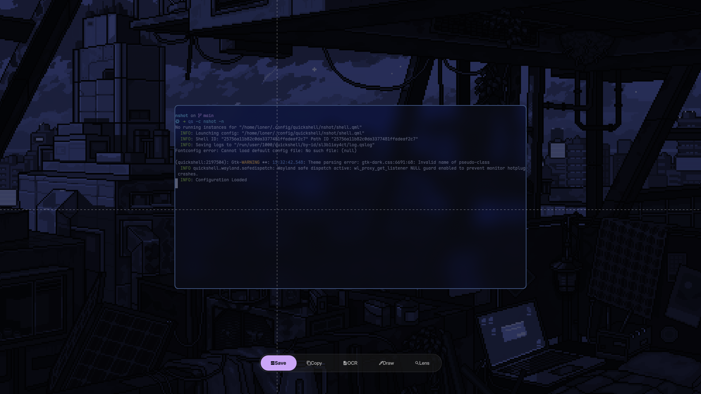

# nshot

A Wayland screenshot tool with OCR and Google Lens support. Built with Quickshell.

## Preview



## Features

- **5 modes**: Save, Copy, OCR, Annotate, Lens
- **Region selection** with dimmed background and size preview
- **Tab/Shift+Tab** to cycle modes
- **Compositor-agnostic**: works on Hyprland, Sway, River, Niri, etc.

## Dependencies

### Required

- **quickshell** - QML-based Wayland shell
- **grim** - Screenshot capture
- **imagemagick** - Image processing
- **tesseract** - OCR (eng+chi_sim)
- **wl-clipboard** - Clipboard support
- **xdg-utils** - Desktop integration
- **libnotify** - Notifications
- **[Satty](https://github.com/giantvince/satty)** - Annotation tool for Draw mode

## Modes

| Mode | Action                                        |
| ---- | --------------------------------------------- |
| Save | Save to `~/Pictures/Screenshots/` + clipboard |
| Copy | Copy to clipboard                             |
| OCR  | Extract text (Tesseract) → clipboard          |
| Lens | Open in Google Lens                           |
| Draw | Annotate in Satty → clipboard                 |

## Installation

### Arch

```bash
sudo pacman -S grim imagemagick tesseract wl-clipboard libnotify
```

### NixOS

Add `nshot` to your flake inputs:

```nix
{
  inputs = {
    nixpkgs.url = "github:NixOS/nixpkgs/nixos-unstable";
    nshot.url = "github:lonerOrz/nshot";
  };

  outputs = { nixpkgs, nshot, ... }: {
    nixosConfigurations.yourHost = nixpkgs.lib.nixosSystem {
      modules = [
        ({ pkgs, ... }: {
          environment.systemPackages = [ nshot.packages.${pkgs.stdenv.hostPlatform.system}.default ];
        })
      ];
    };
  };
}
```

Or run directly:

```bash
nix run github:lonerOrz/nshot
```

### Manual

```bash
mkdir -p ~/.config/quickshell
git clone https://github.com/lonerOrz/nshot.git ~/.config/quickshell/nshot
```

## Usage

1. Launch with keybind
2. Click and drag to select region
3. Release to execute action
4. Right-click to cancel

## Configuration

Add a keybind to your compositor:

### Hyprland

```ini
bind = $mainMod SHIFT, T, exec, quickshell -c nshot -n
```

### Niri

```kdl
binds {
    Mod+Shift+T { spawn "quickshell" "-c" "nshot" "-n"; }
}
```

If selection appears offset, try:

```bash
env QT_SCALE_FACTOR=1 QT_AUTO_SCREEN_SCALE_FACTOR=0 quickshell -c nshot -n
```

## Inspiration

Inspired by [QuickSnip](https://github.com/Ronin-CK/QuickSnip).

## License

This project is licensed under the BSD 3-Clause License.

---

> If you find `nshot` useful, please give it a ⭐ and share! 🎉
