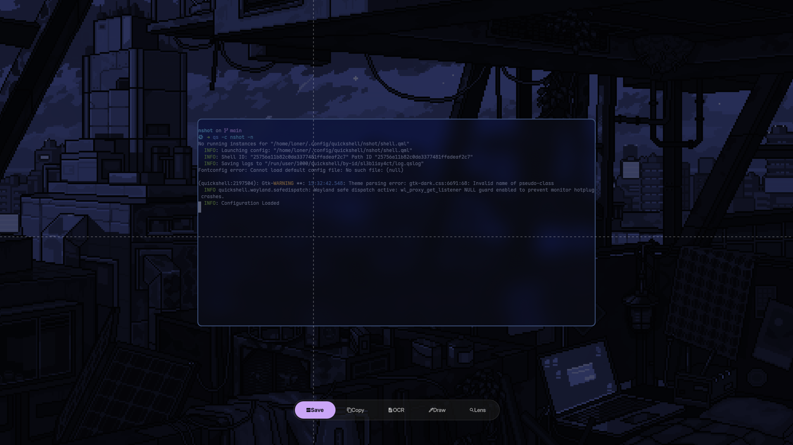

# nshot

A blazing-fast Wayland screenshot tool with OCR, Google Lens, and Satty annotation. Built with [Quickshell](https://quickshell.outfoxxed.me/).



## Modes

| Mode        | Action                                                | Dependency    |
| :---------- | :---------------------------------------------------- | :------------ |
| **󰋮 Save**  | Save to `~/Pictures/Screenshots/` + copy to clipboard | _None (Core)_ |
| **󰆏 Copy**  | Copy cropped image to clipboard                       | _None (Core)_ |
| **󰈊 Satty** | Annotate in Satty → save + copy                       | `satty`       |
| **󰈙 OCR**   | Extract text (English + Simplified Chinese)           | `tesseract`   |
| **󰍉 Lens**  | Search with Google Lens in browser                    | `xdg-utils`   |

> Missing optional tools will simply disable their respective tabs without breaking core functionality.

## Dependencies

- **Required:** `quickshell`, `grim`, `imagemagick`, `wl-clipboard`
- **Optional:** `satty`, `tesseract` (with `eng` & `chi_sim` data), `xdg-utils` (`xdg-open`), `libnotify`, `Symbols Nerd Font`

## Installation

### Nix / NixOS

```bash
# Run directly
nix run github:lonerOrz/nshot
```

<details>
<summary>Flake configuration</summary>

```nix
{
  inputs.nshot.url = "github:lonerOrz/nshot";

  outputs = { nixpkgs, nshot, ... }: {
    nixosConfigurations.yourHost = nixpkgs.lib.nixosSystem {
      modules = [{
        environment.systemPackages = [ nshot.packages.${system}.default ];
      }];
    };
  };
}
```

</details>

### Arch Linux

```bash
# Core + optional dependencies
sudo pacman -S grim imagemagick wl-clipboard \
  satty tesseract tesseract-data-eng tesseract-data-chi_sim xdg-utils libnotify ttf-nerd-fonts-symbols

# Clone config
git clone https://github.com/lonerOrz/nshot.git ~/.config/quickshell/nshot
```

## Keybindings & Usage

| Input                     | Action                              |
| :------------------------ | :---------------------------------- |
| **Drag & Release**        | Select area and execute active mode |
| **Tab** / **Shift+Tab**   | Switch modes                        |
| **Right-click** / **Esc** | Cancel                              |

### Compositor Setup

```ini
# Hyprland
bind = $mainMod SHIFT, T, exec, nshot  # or: quickshell -c nshot -n

# Sway
bindsym $mod+Shift+t exec nshot

# Niri
binds { Mod+Shift+T { spawn "nshot"; } }
```

## Acknowledgments & License

- Inspired by [QuickSnip](https://github.com/Ronin-CK/QuickSnip).
- Licensed under [BSD 3-Clause](LICENSE).
